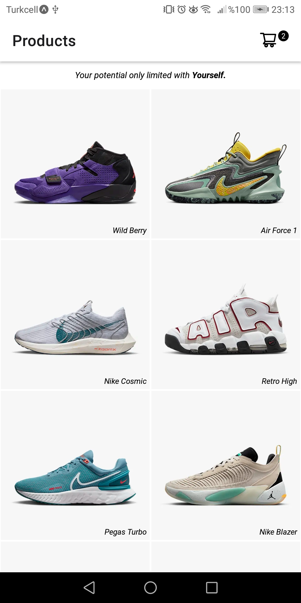
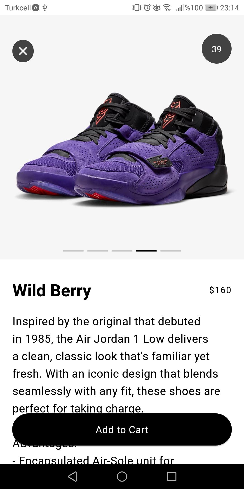
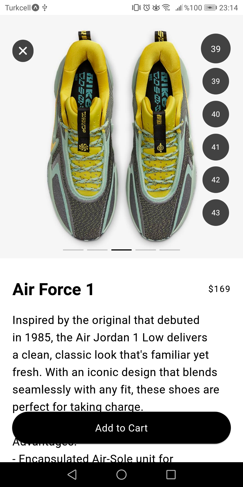
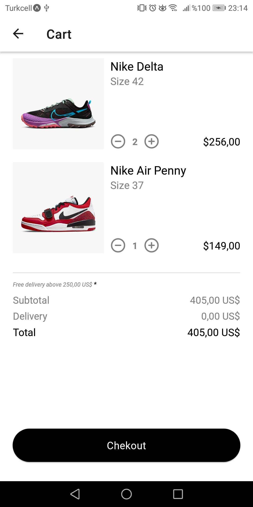

# React-Native-NikeDemoApp

This is a fully working demo nike mobile store app with frontend and state management. Developed with React Native Expo module.

# Build with
* 
* 
* 

* <a href="https://reactnavigation.org/"> React Navigation</a>    

## How To Use

To run this application, you'll need Expo Go app on your mobile device. You can take this [guide](https://reactnative.dev/docs/environment-setup?package-manager=npm). 

## Screeshots

